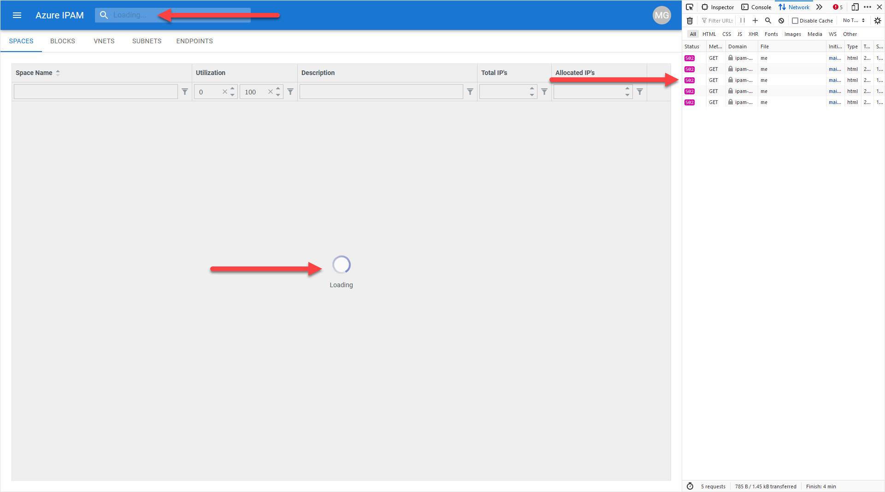
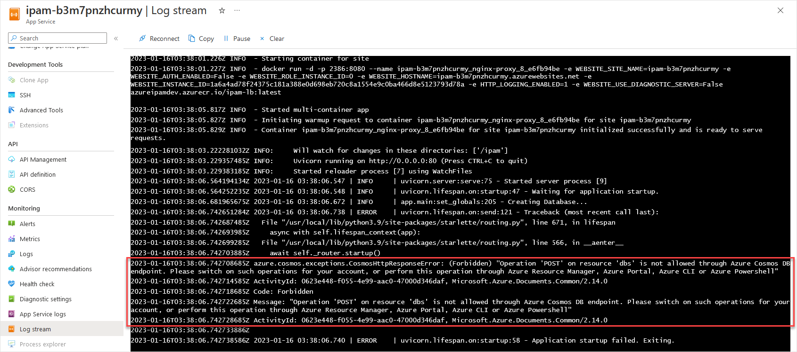

# Troubleshooting

## Cosmos DB DisableKeyBasedMetadataWriteAccess

#### <u>Symptoms</u>

- Spaces, Blocks, Virtual Networks, Subnets, and Endpoints fail to load
- HTTP 502 responses are visible for the "me" call in the Developer Tools networking view



- An error in the Application Log for the App Service stating that the *Operation is not allow through the Azure Cosmos DB endpoint*.



#### <u>Verify</u>

You can check to see if the flag ```DisableKeyBasedMetadataWriteAccess``` is set on your Cosmos DB resource by running one of the following commands:

**Azure PowerShell**

```powershell
Get-AzCosmosDBAccount -ResourceGroupName <ResourceGroupName> -Name <CosmosDBAccountName>
```


**Azure CLI**
```bash
az cosmosdb show --resource-group <ResourceGroupName> --name <CosmosDBAccountName>
```


#### <u>Resolve</u>

Set the ```DisableKeyBasedMetadataWriteAccess``` flag to ```false``` using one of the following commands:

**Azure PowerShell**

```powershell
Update-AzCosmosDBAccount -ResourceGroupName <ResourceGroupName> -Name <CosmosDBAccountName> -DisableKeyBasedMetadataWriteAccess $false
```

**Azure CLI**
```bash
az cosmosdb update --resource-group <ResourceGroupName> --name <CosmosDBAccountName> --disable-key-based-metadata-write-access false
```

#### <u>Notes</u>

This flag may have been set by [Azure Policy](https://learn.microsoft.com/en-us/azure/governance/policy/overview). You can find more details about this policy [here](https://learn.microsoft.com/en-us/azure/cosmos-db/policy-reference#azure-cosmos-db) under *Azure Cosmos DB key based metadata write access should be disabled*. You may need to contact your policy administrator to request an exception for Azure IPAM.
