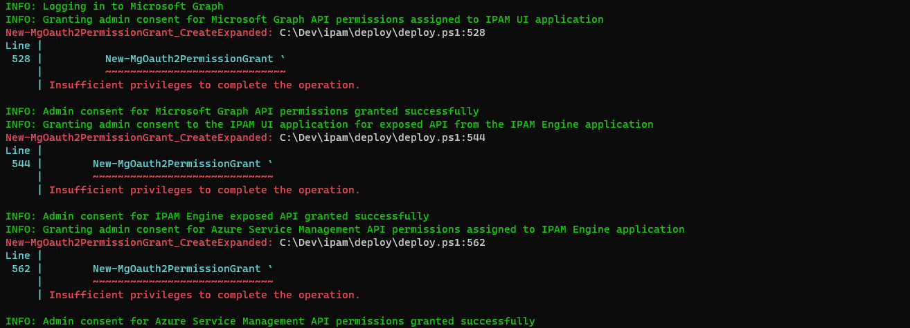

# Troubleshooting

## New-AzRoleAssignment (Failed)

#### <u>Symptoms</u>

During the deployment of Azure IPAM, you see an error similar to the following:


#### <u>Verify</u>

You can check to see if you have the necessary permissions on the Tenant Root Group in the Azure Portal by navigating to [Management Groups](https://learn.microsoft.com/en-us/azure/governance/management-groups/overview)

If you cannot click on the *Tenant Root Group*, then you likely don't have access to the *Tenant Root Group* at all.


Once you select the Tenant Root Group, under *Access Control (IAM)* you can click on *View my access* to see what RBAC permissions your currently logged in user has.


You can see from the above image, this user only has the ```Reader``` role, which isn't sufficient to deploy the Azure IPAM solution.

#### <u>Resolve</u>

Contact your Azure Administrator (or equivalent) to request a role which has ```Microsoft.Authorization/roleAssignments/write``` at the *Tenant Root Group* level.

This role could be one of the following:

- [Owner](https://learn.microsoft.com/en-us/azure/role-based-access-control/built-in-roles#owner)
- [User Access Administrator](https://learn.microsoft.com/en-us/azure/role-based-access-control/built-in-roles#user-access-administrator)
- [Custom Role](https://learn.microsoft.com/en-us/azure/role-based-access-control/custom-roles) with *allow* permissions of `Microsoft.Authorization/roleAssignments/write`

#### <u>Notes</u>

You can read more about the requirements for deploying Azure IPAM in the [Prerequisites](/deployment/README?id=prerequisites) section of the deployment guide.

## New-MgOauth2PermissionGrant (Failed)

#### <u>Symptoms</u>

During the deployment of Azure IPAM, you see an error similar to the following:



#### <u>Verify</u>

The role of [Global Administrator](https://learn.microsoft.com/en-us/azure/active-directory/roles/permissions-reference#global-administrator) is required to deploy the Azure IPAM solution. This role is needed to [grant admin consent](https://learn.microsoft.com/en-us/azure/active-directory/manage-apps/grant-admin-consent?pivots=portal) for the API permissions used by the Azure IPAM [App Registrations](https://learn.microsoft.com/en-us/azure/active-directory/develop/app-objects-and-service-principals#application-registration).

Navigate to your user in Azure Active Directory and check your current [Role Assignments](https://learn.microsoft.com/en-us/azure/active-directory/fundamentals/active-directory-users-assign-role-azure-portal)


You can see from the image above that the [Global Administrator](https://learn.microsoft.com/en-us/azure/active-directory/roles/permissions-reference#global-administrator) role is not present.

#### <u>Resolve</u>

Contact your Azure Active Directory Administrator (or equivalent) to request the [Global Administrator](https://learn.microsoft.com/en-us/azure/active-directory/roles/permissions-reference#global-administrator) role.

Alternatively, if your organization (like many) has separate groups whom manage Azure Active Directory permissions and Azure infrastructure, you can leverage the two-step deployment method for Azure IPAM where a member of the [Global Administrators](https://learn.microsoft.com/en-us/azure/active-directory/roles/permissions-reference#global-administrator) can deploy the required [App Registrations](https://learn.microsoft.com/en-us/azure/active-directory/develop/app-objects-and-service-principals#application-registration), then pass the generated [Parameters](https://learn.microsoft.com/en-us/azure/azure-resource-manager/templates/parameter-files) file to the Azure Infrastructure team to complete the deployment.

Here are the steps from the [Deployment](/deployment/README) section:

1. [App Registration Only Deployment](/deployment/README?id=app-registration-only-deployment)
2. [Infrastructure Stack (Only) Deployment](/deployment/README?id=infrastructure-stack-only-deployment)

#### <u>Notes</u>

You can read more about the requirements for deploying Azure IPAM in the [Prerequisites](/deployment/README?id=prerequisites) section of the deployment guide.

## DisableKeyBasedMetadataWriteAccess (Cosmos DB)

#### <u>Symptoms</u>

- Spaces, Blocks, Virtual Networks, Subnets, and Endpoints fail to load
- HTTP 502 responses are visible for the "me" call in the Developer Tools networking view


- An error in the Application Log for the App Service stating that the *Operation is not allow through the Azure Cosmos DB endpoint*.


#### <u>Verify</u>

You can check to see if the flag ```DisableKeyBasedMetadataWriteAccess``` is set on your Cosmos DB resource by running one of the following commands:

**Azure PowerShell**

```powershell
Get-AzCosmosDBAccount -ResourceGroupName <ResourceGroupName> -Name <CosmosDBAccountName>
```


**Azure CLI**
```bash
az cosmosdb show --resource-group <ResourceGroupName> --name <CosmosDBAccountName>
```


#### <u>Resolve</u>

Set the ```DisableKeyBasedMetadataWriteAccess``` flag to ```false``` using one of the following commands:

**Azure PowerShell**

```powershell
Update-AzCosmosDBAccount -ResourceGroupName <ResourceGroupName> -Name <CosmosDBAccountName> -DisableKeyBasedMetadataWriteAccess $false
```

**Azure CLI**
```bash
az cosmosdb update --resource-group <ResourceGroupName> --name <CosmosDBAccountName> --disable-key-based-metadata-write-access false
```

#### <u>Notes</u>

This flag may have been set by [Azure Policy](https://learn.microsoft.com/en-us/azure/governance/policy/overview). You can find more details about this policy [here](https://learn.microsoft.com/en-us/azure/cosmos-db/policy-reference#azure-cosmos-db) under *Azure Cosmos DB key based metadata write access should be disabled*. You may need to contact your policy administrator to request an exception for Azure IPAM.
